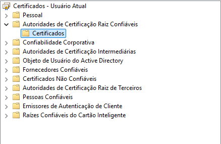
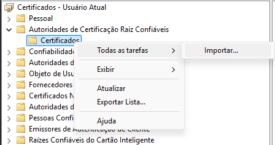

# AULA 10

## subir os containers

```
docker compose -f docker-compose.yml -f docker-compose.infra.yml up
```

## alterar arquivos hosts

vá até o arquivo host do seu sistema,

no windows normalmente fica em :

**_C:\Windows\System32\drivers\etc_**

e adicione o seguinte valor no final do arquivo hosts:

```
127.0.0.1       devopsnanuvem.internal
```

neste caso devopsnanuvem.internal é resolvido para 127.0.0.1 que é o localhost

## configurar Certificate Authority como confiavel no seu sistema

busque por: 'gerenciar certificados de usuario' no seu windows:
entre em autoridade de certificacao raiz confiaveis/certificados



iniciar fluxo importar certificado



## testar se esta funcionando corretamente:

https://devopsnanuvem.internal:44300/main/health
